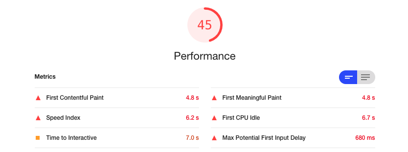
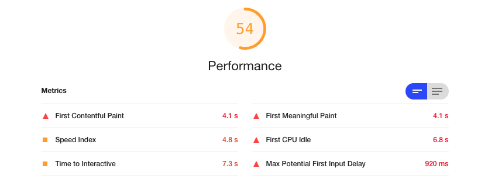
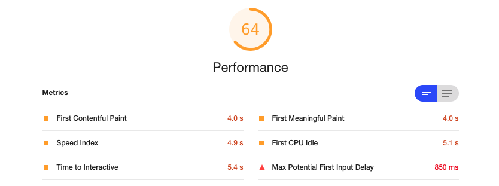
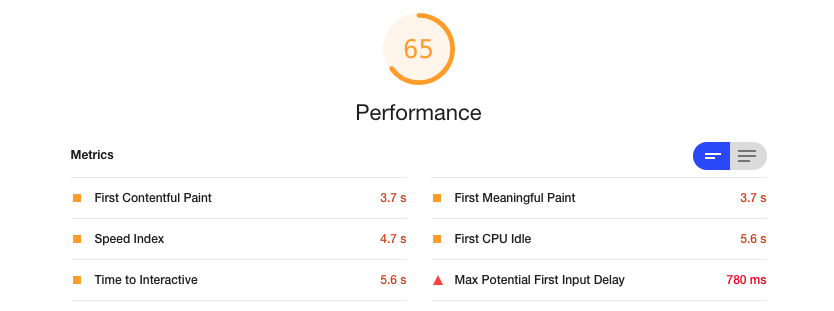

# Image Lazy Loading

- 사용자가 웹페이지에 들어오면 여러가지 이미지들을 한꺼번에 로드할 수 있는데 만약 첫번째 사진만 보고 떠나는 경우라면 사진 한장을 보기위해 나머지 사진까지 로드하느라 시간과 메모리, 네트워크 자원을 낭비하게 된 꼴이다.

- SEO
  - lazy loading 을 하게 되면 검색엔진이 페이지의 리소스를 잘못 해석하거나 무시할 수 있기 때문에 이에 대한 콘텐츠 링크를 제공해줘야함.

---

# onLoad, .gif 이벤트 활용


생각하기에 가장 간단한 방법이다. img 태그에 onLoad 이벤트가 발생하기 전까지는 로딩중인 `gif` 를 보여주고 이미지 로드가 끝나면 `gif` 는 안보이고 실제 이미지가 나오면 된다. 이미지가 아직 로딩중일 떄는 css 로 `display: none` 처리해준다.

사실상 이 방법은 이미지를 `lazy loading` 한건 아니고 눈속임으로 이미지가 로딩중일 떄 다른이미지를 보여주는 방식이다. 그래서 성능상의 이점은 없을듯 싶고 단지 사용자에게 '아 이미지가 로딩중이구나' 라는 인식만 심어줄 수 있다.

[코드보기](../src/components/ImageWithGIF/ImageWithGIF.tsx)

```typescript
import React, { useState } from "react";
import styled from "styled-components";
import spinner from "assets/loading.gif";

interface ImgProp {
  isImageLoading: boolean;
}

interface Props {
  src: string;
}

const S = {
  Img: styled.img<ImgProp>`
    width: fit-content;
    margin: auto;
    display: ${({ isImageLoading }) => (isImageLoading ? "none" : "block")};
  `,
};

const ImageWithGIF: React.FC<Props> = ({ src }) => {
  const [isImageLoading, setIsImageLoading] = useState<boolean>(true);

  return (
    <>
      {isImageLoading && }
      <S.Img
        src={src}1
        onLoad={() => setIsImageLoading(false)}
        isImageLoading={isImageLoading}
      />
    </>
  );
};

export default ImageWithGIF;
```

### lighthouse 결과



---

# data-src 활용


이번에는 `img` `src` 속성에 바로 이미지 주소를 적어주지 않는다. `data-src` 속성에다가 적어주고 src 속성에는 그냥 하얀색 화면을 보여주도록 한다. 이미지는 바로 로드가 되지 않을 것이고 `useEffect` 안에서 [이미지](https://developer.mozilla.org/en-US/docs/Web/API/HTMLImageElement/Image) 인스턴스를 만들어서 로드를 하게 될 텐데 여기서 로드가 완료되고 나서 실제 이미지 태그에 `src` 속성을 로드된 이미지로 바꿔준다.

동작하는 `gif` 에서도 하얀화면이 나오고 바로 원본이미지가 뜨는걸 볼 수 있다.

[코드보기](../src/components/ImageWithDataSrc/ImageWithData.tsx)

```typescript
import React, { useEffect, useRef } from "react";
import background from "assets/background.png";

interface Props {
  src: string;
}
const ImageWithDataSrc: React.FC<Props> = ({ src }) => {
  const imgRef = useRef<HTMLImageElement>(null);
  const onLoad = (_src: string) => {
    if (!imgRef || !imgRef.current) return;
    imgRef.current.src = _src;
    imgRef.current.removeAttribute("data-src");
    setTimeout(() => {
      if (!imgRef || !imgRef.current) return;
      imgRef.current.style.opacity = "1";
    }, 500);
  };

  useEffect(() => {
    const image = new Image();
    image.src = src;
    image.onload = () => {
      onLoad(src);
    };
  }, [src]);
  return (
    <>
      
    </>
  );
};

export default ImageWithDataSrc;
```

### data-src 이용했을때 lighthouse 결과



약간의 효과는 있었다. `First Contentful Paint` 가 0.7초 줄어들었다. `First Contentful Paint` 는 유저가 페이지에 들어와서 첫번째 DOM 조각하나를 로드하는데 몇초가 걸렸느냐를 나타내는 지표이다. 아까보단 줄어들었으니 좀더 빠른 사이트구나 라는 인상을 줄 수 있을 것이다.

---

# 실제로 늦게 로딩해보기


이번에는 브라우저 뷰포트 내에 해당 이미지 element 가 들어왔을때 비로소 이미지 로딩을 시작한다. 처음에 말했던 시간과 메모리, 네트워크 자원낭비를 막을 수 있을 것으로 기대된다.

현재 뷰포트에 이미지 element 가 들어왔는지 여부는 아래와 같은 if 문으로 판단한다. [getBoundingClientRect()](https://developer.mozilla.org/en-US/docs/Web/API/Element/getBoundingClientRect) 는 뷰포트로부터의 element 의 상대좌표를 알려주는데 여기서 리턴해주는 top 값이 window.innerHeight 보다 작으면서 bottom 이 0 이상이면 현재 뷰포트에 들어와있다는 뜻으로 해석할 수 있다. 그래서 저 조건문 안에서 이미지를 로드해준다.

`if (imgRef.current.src !== background) return;` 는 이미 이미지가 초기화된 경우 이므로 스킵한다.

[코드보기](../src/components/LazyImage/LazyImage.tsx)

```typescript
if (
  el.getBoundingClientRect().top <= window.innerHeight
    && el.getBoundingClientRect().bottom >= 0
  )
```

```typescript
import React, { useEffect, useRef } from "react";
import background from "assets/background.png";

interface Props {
  src: string;
}

const LazyImage: React.FC<Props> = ({ src }) => {
  const imgRef = useRef<HTMLImageElement>(null);
  const scrollHandler = () => {
    if (!imgRef || !imgRef.current) return;

    const el = imgRef.current;
    if (imgRef.current.src !== background) return;
    if (
      el.getBoundingClientRect().top <= window.innerHeight &&
      el.getBoundingClientRect().bottom >= 0
    ) {
      const srcOrigin = imgRef.current.getAttribute("data-src");
      if (srcOrigin) {
        imgRef.current.src = srcOrigin;
        setTimeout(() => {
          if (!imgRef || !imgRef.current) return;
          imgRef.current.style.opacity = "1";
        }, 250);
      }
    }
  };

  useEffect(() => {
    scrollHandler();
    window.addEventListener("scroll", scrollHandler);

    return () => {
      window.removeEventListener("scroll", scrollHandler);
    };
  }, []);
  return (
    <>
      
    </>
  );
};

export default LazyImage;
```

## lazy loading lighthouse 결과



### lazy loading lighthouse (throttling 추가)

추가적으로 여기서는 `scroll` 이벤트를 등록하기 때문에 이벤트 핸들러에 throttling 을 줘봤다. 약간의 성능향상이 보이긴 하지만 같은상황에서도 `lighthouse` 가 그때그떄 다른 수치를 내뱉기 때문에 이정도 차이는 큰 성과라 하기엔 모자란거 같다. 그래도 이벤트 중복 발생을 막으니까 어느정도 의미있다고 생각.

[코드보기](../src/components/LazyImage/LazyImage.tsx)

```typescript
import React, { useEffect, useRef } from "react";
import background from "assets/background.png";

interface Props {
  src: string;
}
// eslint-disable-next-line @typescript-eslint/no-explicit-any
function throttle(delay: number, event: any) {
  // eslint-disable-next-line no-underscore-dangle
  let _throttle: number | null = null;
  return () => {
    if (!_throttle) {
      _throttle = setTimeout(() => {
        event();
        _throttle = null;
      }, delay);
    }
  };
}
const LazyImage: React.FC<Props> = ({ src }) => {
  const imgRef = useRef<HTMLImageElement>(null);
  const scrollHandler = () => {
    if (!imgRef || !imgRef.current) return;

    const el = imgRef.current;
    if (imgRef.current.src !== background) return;
    if (
      el.getBoundingClientRect().top <= window.innerHeight &&
      el.getBoundingClientRect().bottom >= 0
    ) {
      const srcOrigin = imgRef.current.getAttribute("data-src");
      if (srcOrigin) {
        imgRef.current.src = srcOrigin;
        setTimeout(() => {
          if (!imgRef || !imgRef.current) return;
          imgRef.current.style.opacity = "1";
        }, 250);
      }
    }
  };

  useEffect(() => {
    scrollHandler();
    window.addEventListener("scroll", throttle(200, scrollHandler));

    return () => {
      window.removeEventListener("scroll", throttle(200, scrollHandler));
    };
  }, []);
  return (
    <>
      
    </>
  );
};

export default LazyImage;
```

### lazy loading lighthouse (throttling) 결과



## Intersection observer

위의 방법 말고도 [Intersection observer](https://developers.google.com/web/fundamentals/performance/lazy-loading-guidance/images-and-video?hl=ko#intersection_observer_%EC%82%AC%EC%9A%A9) 를 이용해서도 가능하지만 브라우저 호환성이 좋지못하다고 해서..

lazy loading 이 가능하지만 Infinite Scroll 과 연계해서 다음에 다뤄볼 예정

# reference

- https://developers.google.com/web/fundamentals/performance/lazy-loading-guidance/images-and-video?hl=ko
